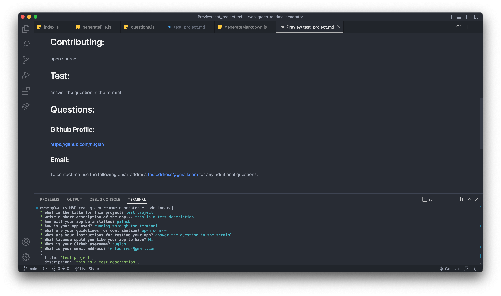

# ryan-green-readme-generator

## Description

A command line application using the inquirer package to quickily generate a read me file from simple responses. It was good practice using node.js and implementing javascript knowledge in the various node features and prctice with writefile, appendfile, and require.

## Installation

What are the steps required to install your project? Provide a step-by-step description of how to get the development environment running.

## Usage

typing "node index.js" into the terminal will start the inquirer process. Answer each question and after all questions are answered the terminal will print "README.md generated". If you look in the output folder there will be a README.md file there with all the content you specified and if previewed, will be formatted nicely.

