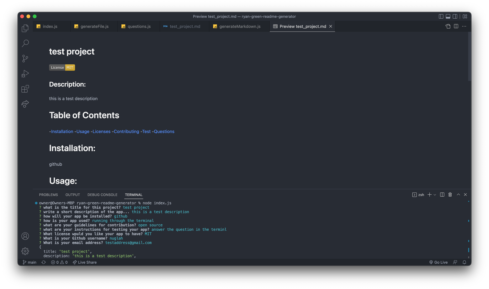

# ryan-green-readme-generator

## Description

A command line application using the inquirer package to quickily generate a read me file from simple responses. It was good practice using node.js and implementing javascript knowledge in the various node features and prctice with writefile, appendfile, and require.

## Installation

If you have node installed and the code from github you can run "node index.js" from the terminal.

## Usage

Link to a video showcasing the functionality (https://drive.google.com/file/d/1mPW46427QKv9S9LHakKpiiDFJqIG2aJ_/view?usp=sharing)
typing "node index.js" into the terminal will start the inquirer process. Answer each question and after all questions are answered the terminal will print "README.md generated". If you look in the output folder there will be a README.md file there with all the content you specified and if previewed, will be formatted nicely.

